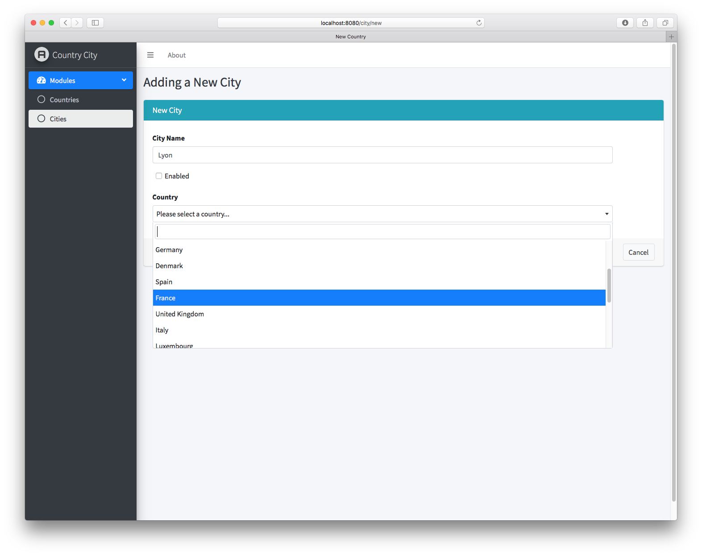
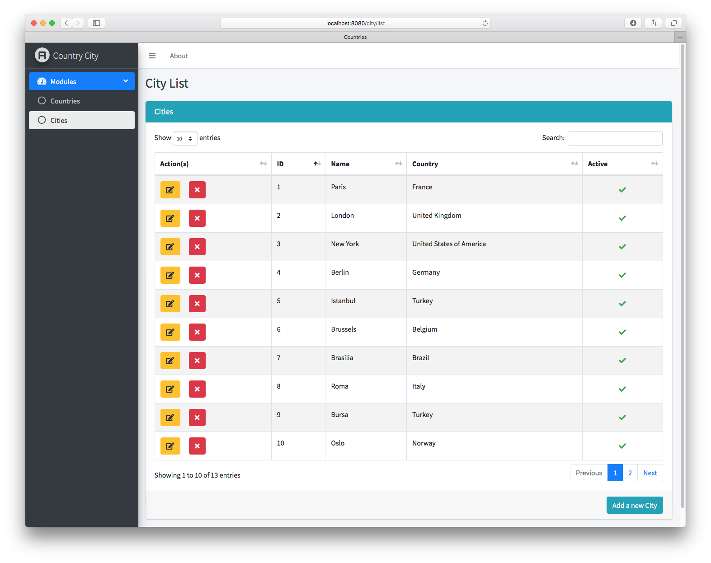
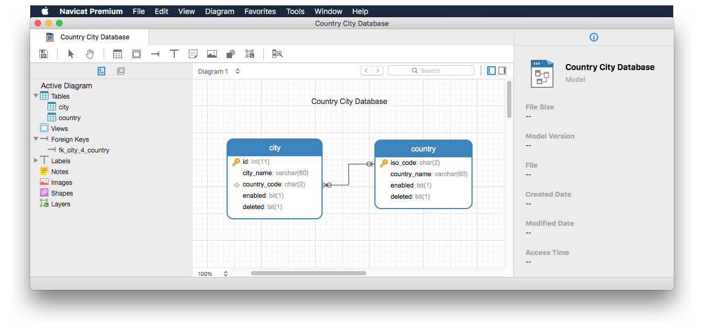

# Country City Database - Spring MVC version
**A Sample Spring MVC CRUD Application with Thymeleaf, HTML5, CSS3 and Bootstrap4-based AdminLTE v3 template**

## Description

In this application, you can see a demonstration of using **Spring Boot**, **Spring Data JPA**, **MySQL**, **Spring MVC**, **Thymeleaf**, **HTML5**, **CSS3** and **Bootstrap** all together to build a foundational web application.

Currently code in this repo includes entity models for inter-related Country and City database tables, as well as controllers and views for country and city records.

MySQL database SQL dump is at the root directory in a file called countrycity.sql

Used in "Getting Started with Web Development" tutorials and training courses by [Gokhan Ozar](https://gokhan.ozar.net "All Systems GO") 

## Screenshots

### Form View

### Grid View

### Database E-R Diagram

A [tutorial](https://www.arclerit.com/blog/new-data-modeling-capabilities-of-navicat-15-in-action/) for designing the relational data model in Navicat and then exporting (DDL of) it to a database can be found at [www.arclerit.com/blog/new-data-modeling-capabilities-of-navicat-15-in-action](https://www.arclerit.com/blog/new-data-modeling-capabilities-of-navicat-15-in-action/)